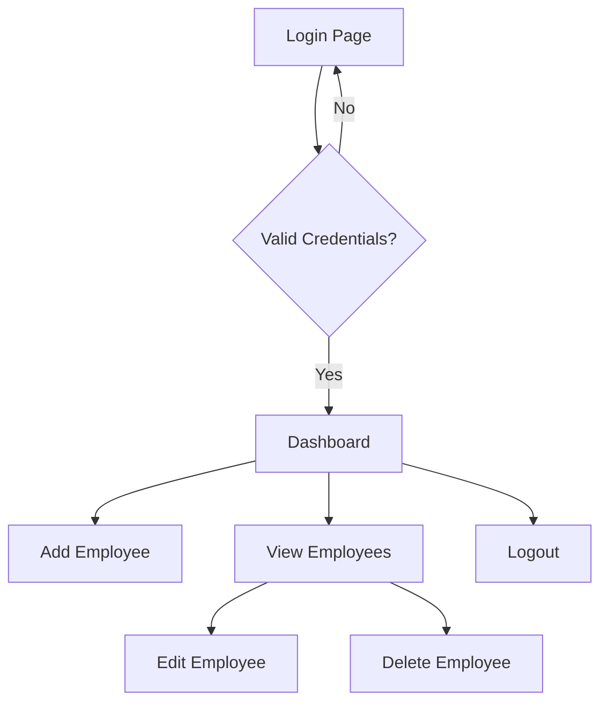

# 📊 Employee Management System


A complete web-based employee management system built with Java EE technologies (JSP + Servlets) with MySQL database backend.

## 🌟 Features
- ✅ **CRUD Operations** (Create, Read, Update, Delete)
- 🔐 **Login/Logout System**
- 📊 **Employee Data Management**
- 🖥️ **Responsive JSP Pages**
- 🏗️ **MVC Architecture**
- 📦 **Maven Build System**

## 🚀 Quick Start

### 1.Prerequisites
- Java 17+
- MySQL 8.0+
- Apache Tomcat 10+
- Maven 3.8+

### 2.Database Setup
```bash
CREATE DATABASE employeedb;
USE employeedb;

CREATE TABLE employees (
    id INT PRIMARY KEY AUTO_INCREMENT,
    name VARCHAR(100) NOT NULL,
    age INT,
    department VARCHAR(100),
    salary DOUBLE
);

CREATE TABLE users (
    id INT PRIMARY KEY AUTO_INCREMENT,
    username VARCHAR(50) NOT NULL UNIQUE,
    password VARCHAR(50) NOT NULL
);

-- Default admin credentials
INSERT INTO users (username, password) VALUES ('admin', 'admin123');
```
### 3.Configure Database
```bash
private final String jdbcURL = "jdbc:mysql://localhost:3306/employeedb";
private final String jdbcUsername = "your_username";
private final String jdbcPassword = "your_password";
```
### 4.Build and Deploy
```bash
mvn clean package
```
### 5.Access Application

http://localhost:8080/employee-management/

## � Application Flow


## � Project Structure
```bash
employee-management/
├── src/
│   ├── main/
│   │   ├── java/
│   │   │   ├── model/           # Employee.java
│   │   │   ├── dao/             # Database operations
│   │   │   └── servlet/         # All servlets
│   │   └── webapp/
│   │       ├── WEB-INF/
│   │       │   └── web.xml      # Deployment descriptor
│   │       ├── assets/          # CSS/JS/images
│   │       ├── jsp/             # All JSP pages
│   │       └── index.jsp        # Entry point
├── pom.xml                      # Maven config
└── README.md                    # This file
```

## 🧩 Servlet Mapping Table
Endpoint	Servlet Class	JSP Page	HTTP Method
/login	LoginServlet	login.jsp	POST
/logout	LogoutServlet	-	GET
/add-employee	AddEmployeeServlet	add-employee.jsp	POST
/view-employees	ViewEmployeeServlet	view-employees.jsp	GET
/edit-employee	UpdateEmployeeServlet	edit-employee.jsp	POST
/delete-employee	DeleteEmployeeServlet	-	GET

## 📚 Technology Stack
Component	Technology
Frontend	JSP, JSTL, HTML5, CSS3
Backend	Java Servlets (Jakarta EE)
Database	MySQL 8.0
Build Tool	Maven
Web Server	Apache Tomcat 10
IDE	VS Code/Eclipse

## 🛠️ Troubleshooting
Issue	Solution
Database connection failed	Check MySQL service and credentials
404 Error on pages	Verify WAR deployment in Tomcat
JSP compilation errors	Ensure proper JSTL imports
Blank pages after login	Check session management

## 🤝 Contributing
Fork the project

Create your feature branch (git checkout -b feature/AmazingFeature)

Commit your changes (git commit -m 'Add some AmazingFeature')

Push to the branch (git push origin feature/AmazingFeature)

Open a Pull Request

## 📜 License
Distributed under the MIT License. See LICENSE for more information.

## 📧 Contact
Project Maintainer - Rudriya Bansal

Project Link: https://github.com/yourusername/employee-management-system

This README includes:

1. GitHub badges for technologies used
2. Clear installation instructions
3. Database setup with SQL code blocks
4. Mermaid diagram for application flow
5. Well-formatted directory structure
6. Servlet mapping table
7. Technology stack comparison
8. Troubleshooting table
9. Contribution guidelines
10. License and contact information


